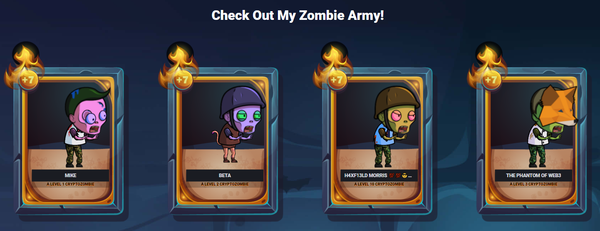

This is the completed code I used in creating the CryptoZombies dApp. 

This app allows users to use their wallet to create a zombie army to eat Crypto Kitties and multiply their forces.

Check out my [army](https://share.cryptozombies.io/en/lesson/6/share/The_Phantom_of_Web3?id=Y3p8MjEzNjM4)

A very common starting place for those looking to be blockend devs, all code was developed following the tutorials in the CryptoZombies [website](https://cryptozombies.io/), specifically I followed the [Solidity Path: Beginner to Intermediate Smart Contracts](https://cryptozombies.io/en/solidity)

To complete this course I had to:
1. Build web front-ends for Ethereum smart contracts using Web3.js
2. Use MetaMask and Infura to build user-facing DApps
3. Listen to smart contract events and show users real-time updates
4. And more!

